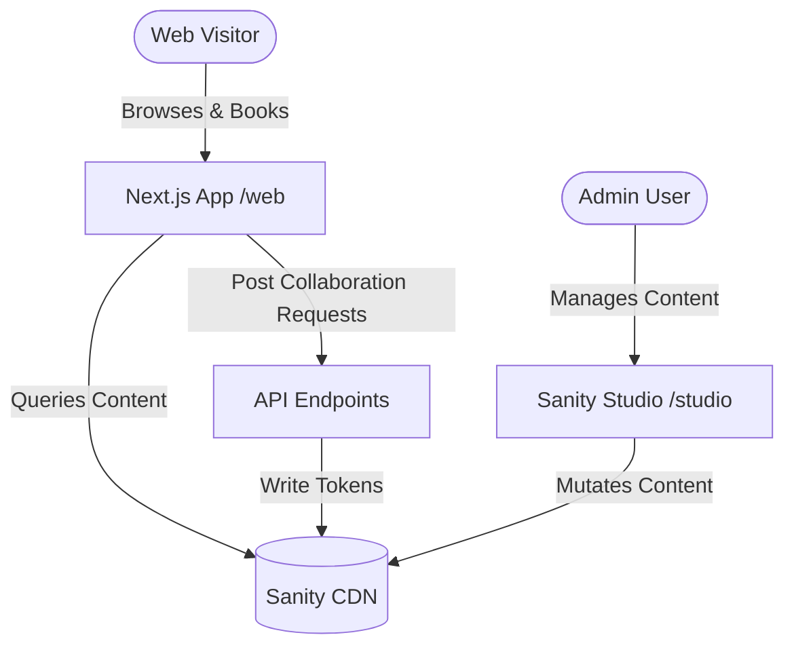

# 🧭 Explorush — Interactive Travel Logs & CMS Portal

Explorush is a premium, high-end travel logs application and content management portal. It combines an interactive travel journal, dynamic map visualization, a blog publication engine, and a booking portal for upcoming group tours. Built as a monorepo, it connects a Next.js frontend with a headless Sanity CMS backend.

---

## 🏗️ Project Architecture

The project is structured as a monorepo:
* **`/web`**: Next.js (App Router, React, TailwindCSS, Framer Motion) client frontend.
* **`/studio`**: Sanity Studio (Headless CMS schemas, inputs, content records).



---

## ✨ Features

### 1. Dynamic Travel Logs & Cost Tracker
* **Interactive Journals**: Immersive cards mapping trip highlights, locations, itineraries, and media.
* **Cost Tracker**: Built-in trip budget displays (e.g. `₹15,000 completed trip`) with prominent badges on cards and detail pages.
* **Mobile-First Shareable Links**: Instant sharing sheet (`navigator.share`) or fallbacks to copy deep-linked trips to clipboard with custom visual feedback notifications.

### 2. Global Footprints Interactive Map
* **Hybrid Geocoding**: Plots locations using Leaflet and OpenStreetMap.
* **Progressive Fallback Resolution**: When specific coordinates or addresses aren't resolved immediately, the geocoder recursively attempts fallback checks by trimming specific address elements (left-to-right) to resolve state or country boundaries.
* **GEODIC Dictionary**: Built-in coordinate fallback dictionary for common regions to bypass geocoding API delays.
* **Explicit Config**: Direct coordinate overriding (Latitude/Longitude) configuration through the admin portal.

### 3. Homepage Magazine & Tours Carousels
* **Magazine Blogs**: Client-side snap-carousel display showcasing 3 cover cards initially before enabling horizontal scroll animations.
* **Upcoming Group Tours & Events**: Clean horizontal scroll layouts and cards for events, complete with booking overlays.

### 4. Direct Support & Bug Report Form
* **In-App Support Modal**: Popup modal located in the footer menu letting users file issues (Bugs, Content Errors, Feedback).
* **Native Draft Redirection**: Automatically generates a formatted `mailto:` URI, opening the user's native email client with pre-filled support details directing to `chorgheharsh07@gmail.com`.

### 5. Secure In-Memory Admin Portal
* **Transient Memory Auth**: Completely secure client-side React state validation. No cookies, localStorage, or sessionStorage are saved locally, prompting the user for the password `Harsh@1136` on refreshes or initial load.
* **Seamless Navigation**: Employs layout-level state wrappers so client-side navigation within the sidebar (Trips, Blogs, Vlogs, etc.) does not prompt repeatedly.

---

## 🛠️ Tech Stack

| Component | Technology | Description |
| :--- | :--- | :--- |
| **Frontend** | Next.js 16 (App Router) | React Server Components, Dynamic client views, API routes |
| **Styling** | TailwindCSS & Vanilla CSS | Glassmorphic cards, fluid layout elements, cream colors |
| **Animations** | Framer Motion | Fade-ins, slide-ins, modal layouts, list transitions |
| **Icons** | Lucide React | Clean icon systems for badges and CTAs |
| **Map Rendering**| React Leaflet | OpenStreetMap tiles, custom geocoded markers & popups |
| **Backend CMS** | Sanity Studio v3 | Document database, media assets, write client mutation |

---

## ⚙️ Configuration & Environment Variables

### Web App `/web`
Create a `.env.local` file inside the `web/` directory and configure the following variables:

```env
# Sanity Config
NEXT_PUBLIC_SANITY_PROJECT_ID="your_project_id"
NEXT_PUBLIC_SANITY_DATASET="production"
SANITY_API_WRITE_TOKEN="your_write_token"

# App Credentials
ADMIN_PORTAL_PASSWORD="your_admin_portal_password"
```

### Sanity Studio `/studio`
Ensure `sanity.config.js` is correctly linked to your project ID and dataset.

---

## 🚀 Local Development

Follow these steps to spin up the local development servers:

### 1. Run the Frontend (Next.js)
```bash
cd web
npm install
npm run dev
```
The client app runs on [http://localhost:3000](http://localhost:3000).

### 2. Run the CMS Dashboard (Sanity)
```bash
cd studio
npm install
npm run dev
```
The studio dashboard runs on [http://localhost:3333](http://localhost:3333).

---

## 📁 File Structure & Key Code References

* [Footer.tsx](file:///e:/PROJECTS/Explorush/web/components/Footer.tsx): Contains the reduced height footer layout and the support email popup modal.
* [Navbar.tsx](file:///e:/PROJECTS/Explorush/web/components/Navbar.tsx): Header navigation bar with client routing.
* [AdminAuthWrapper.tsx](file:///e:/PROJECTS/Explorush/web/components/admin/AdminAuthWrapper.tsx): Handles state-based in-memory portal protection.
* [layout.tsx](file:///e:/PROJECTS/Explorush/web/app/admin/layout.tsx): Wraps dashboard subpages securely.
* [queries.ts](file:///e:/PROJECTS/Explorush/web/lib/queries.ts): Central repository of Sanity GROQ query definitions.
* [GlobalFootprints.tsx](file:///e:/PROJECTS/Explorush/web/components/home/GlobalFootprints.tsx): Geocoding fallbacks, Leaflet integration, and interactive markers.

---

## ☁️ Deployment

### Next.js on Vercel
1. Set the **Root Directory** settings in Vercel to `web`.
2. Configure environmental keys (`NEXT_PUBLIC_SANITY_PROJECT_ID`, `NEXT_PUBLIC_SANITY_DATASET`, `SANITY_API_WRITE_TOKEN`).
3. Deploy. The configurations in `next.config.ts` are ready for runtime asset optimization.

### Sanity Studio hosting
Deploy the schema editor via Sanity command line:
```bash
cd studio
npx sanity deploy
```